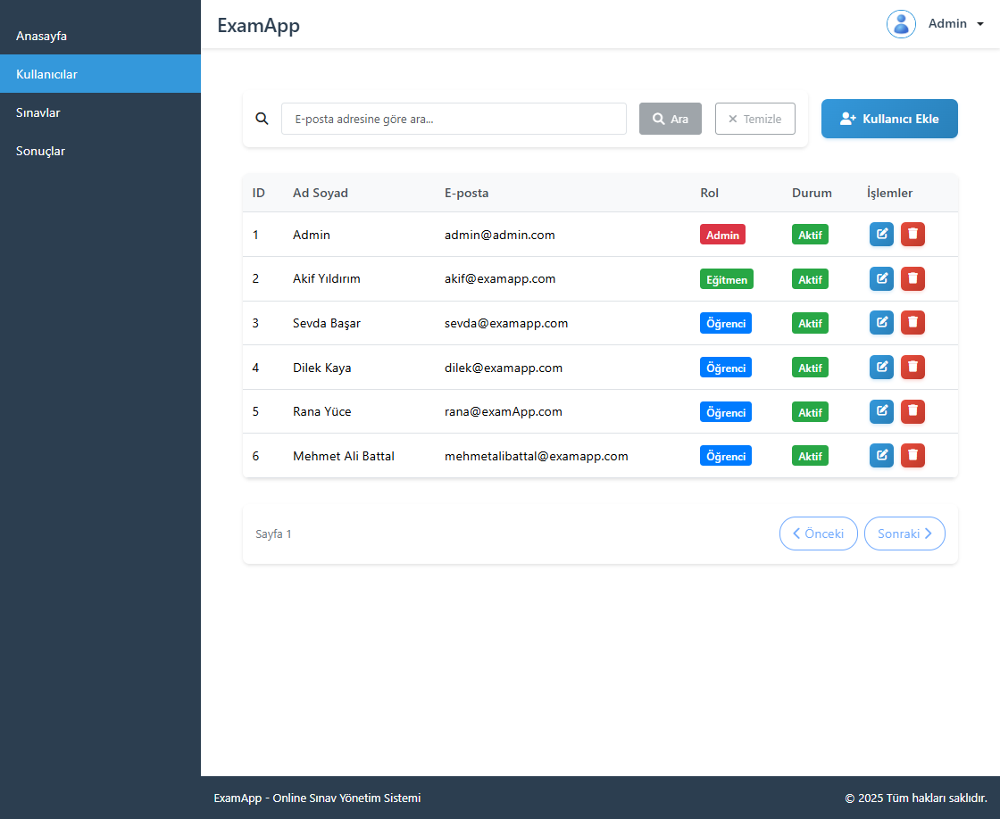
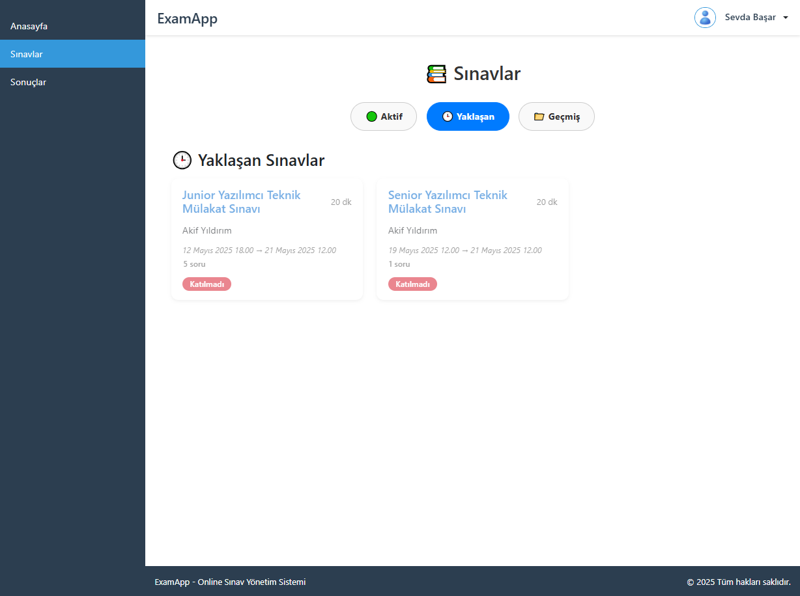
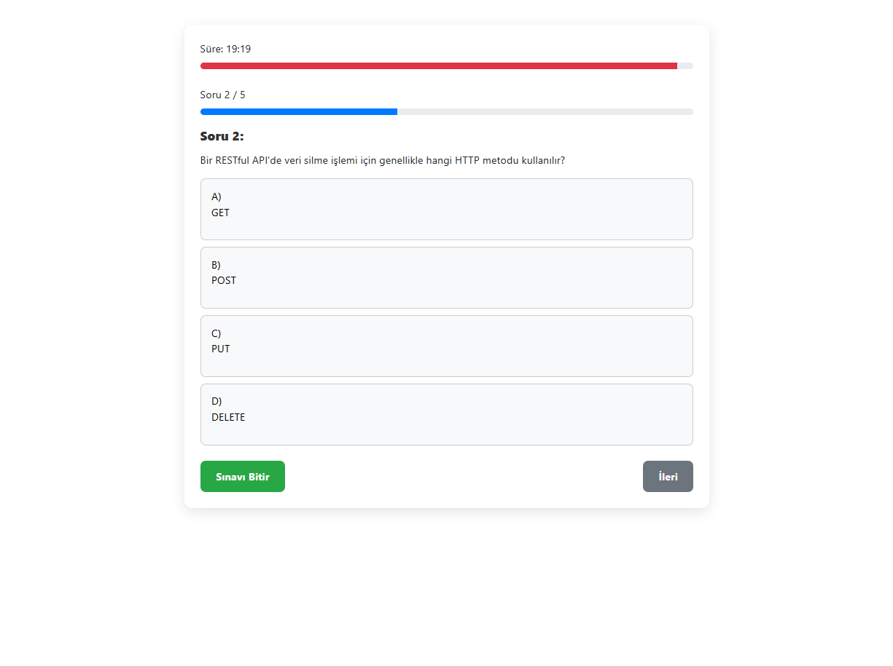
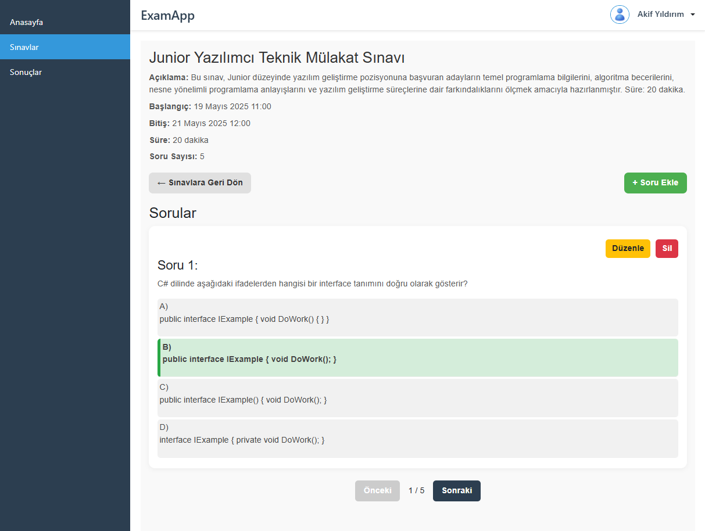
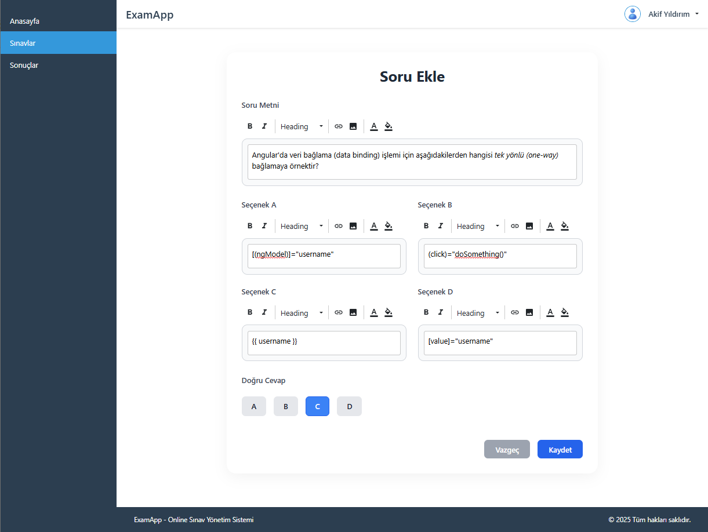
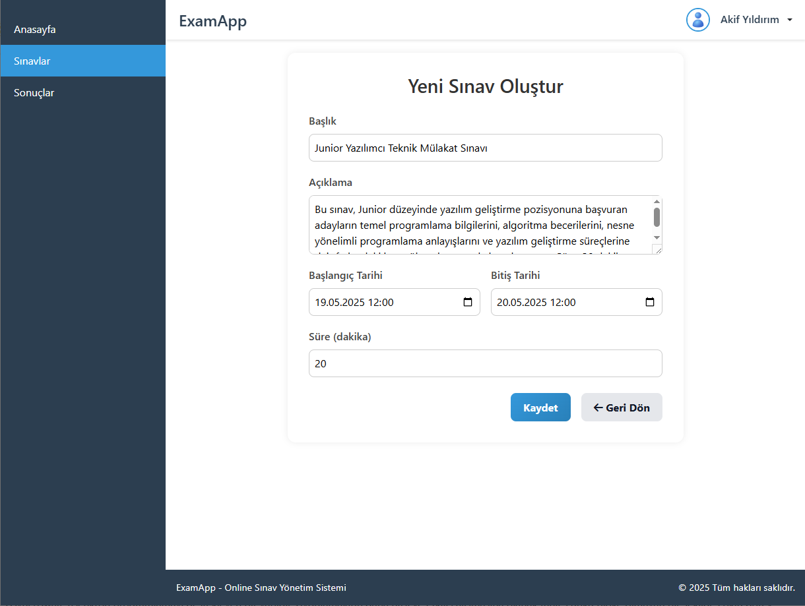
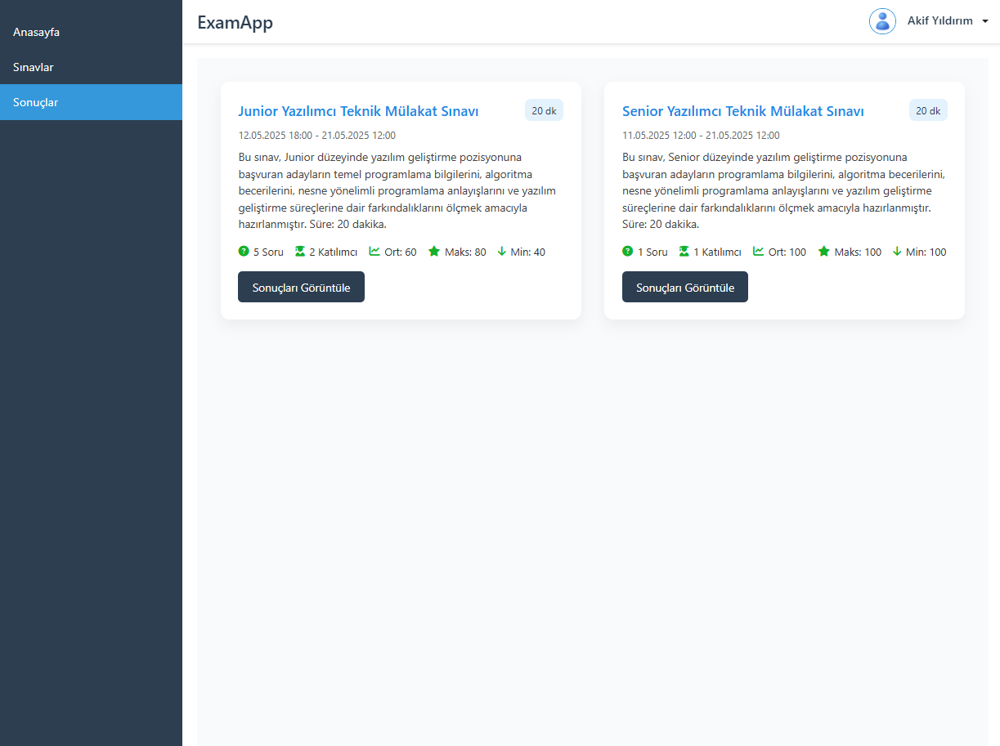
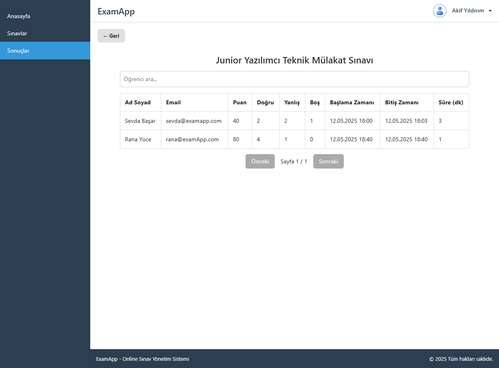
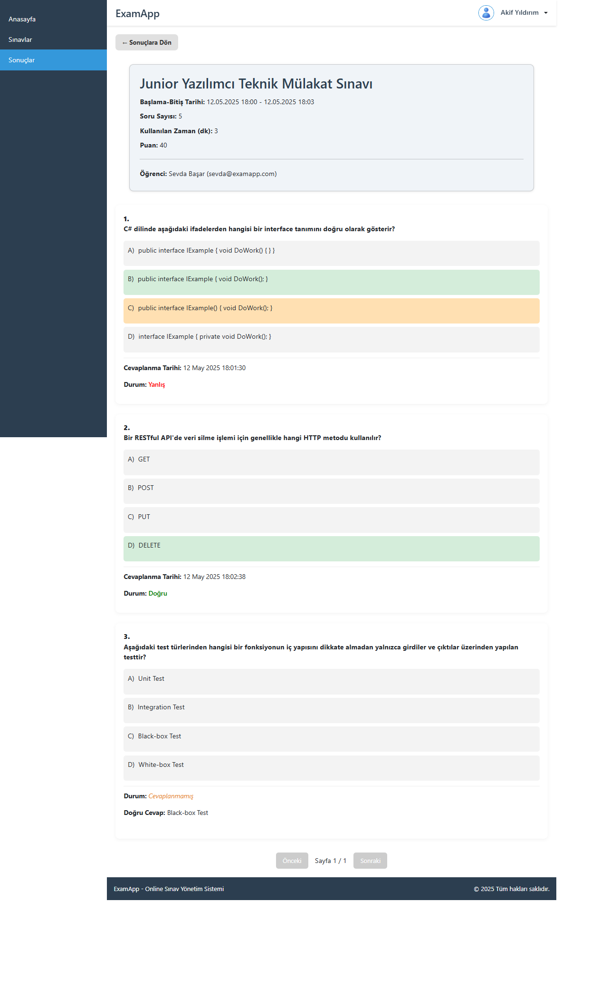

# 🎓 ExamApp - Online Sınav Uygulaması (Frontend - Angular)

**ExamApp**, modern yazılım mimarileri ve güvenlik standartları kullanılarak geliştirilmiş, çok rollü (Admin, Instructor, Student) bir çevrim içi sınav uygulamasıdır. Kullanıcılar sınav oluşturabilir, katılabilir ve sonuçlarını görüntüleyebilir. Bu proje Angular ile geliştirilmiş frontend kısmını içerir ve .NET 8 Web API ile haberleşir.

## 🚀 Backend Projesi
.NET 8 Web API ile oluşturulan beckend projesine [buradan](https://github.com/mabattal/ExamApp-Clean) ulaşabilirsiniz.

---

## 🖥️ Proje Görselleri

| Admin - Kullanıcılar | Öğrenci - Sınavlar | Öğrenci - Sınav Ekranı |
|-------|--------------------|------------------------|
|  |  |  |

| Eğitmen - Sınav Detay | Eğitmen - Soru Ekle | Eğitmen - Sınav Ekle |
|-------|--------------------|------------------------|
|  |  |  |

| Eğitmen - Sonuç İstatikleri | Eğitmen - Sınav Sonuç Listesi | Eğitmen - Sınav Sonuç Detay |
|-------|--------------------|------------------------|
|  |  |  |


---

## 🧩 Kullanılan Teknolojiler

- **Angular 19+** (standalone components ile)
- **TypeScript**
- **RxJS**
- **SCSS / CSS**
- **JWT Authentication**
- **Lazy Loading**
- **Role-based Routing (Admin / Instructor / Student)**
- **Reactive & Template Driven Forms**
- **Custom Pipes & Guards**
- **Responsive Tasarım (Mobil Uyumlu)**

---

## 📦 Kurulum ve Çalıştırma

### 1. Repo'yu Klonla
```bash
git clone https://github.com/mabattal/ExamApp-UI-A
cd ExamApp-UI-A
```

### 2. Bağımlılıkları Kur
```bash
npm install
```

### 3. Ortam Ayarlarını Yap

src/environments/environment.ts dosyasına git ve API adresini ekle:
```bash
const baseApiUrl = 'https://localhost:7203';
```

### 4. Uygulamayı Başlat
```bash
ng serve
```

---

## 🔐 Giriş Bilgileri (Demo için)
| Rol     | Email                     | Şifre          |
| ------- | ------------------------- | -------------- |
| Admin   | admin@admin.com           | Admin123       |

---

## 🧭 Routing Yapısı

Angular routing modülünde kullanıcı rolleri için farklı modüller tanımlandı:

- /admin/** → Admin paneli

- /instructor/** → Eğitmen paneli

- /student/** → Öğrenci paneli

- /login → Giriş ekranı

- /not-found → 404 sayfası

🛡️ AuthGuard ile JWT token kontrolü ve role bazlı erişim kısıtlamaları uygulanmaktadır.

---

💡 Proje herkese açıktır. Pull request'ler ve issue bildirimleri memnuniyetle karşılanır.
